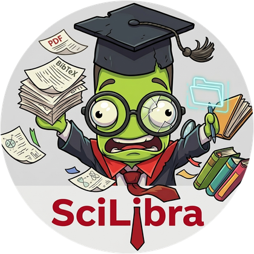

# SciLibra

SciLibra is a free and open-source desktop application for managing scientific articles.
Keep your BibTeX references and PDF files together, browse them by keywords, tag groups,
authors, year or journal, search everything, write comments, and export clean BibTeX.

## Features

- **Add articles in several ways**
  - import a `.bib` file (all entry types: article, inproceedings, book, thesis, ...).
    PDFs named `<key>.pdf` next to the file are linked automatically;
  - paste BibTeX copied from Google Scholar, a journal website, etc.;
  - **add PDF files or a whole folder of PDFs**: the DOI is read from each PDF and the
    details (title, authors, journal, year, abstract...) are downloaded from Crossref.
    Without internet the title is taken from the PDF, and you can complete it later;
  - fill in a form (type a DOI and press *Fetch details* to fill it for you).
- **Browse** by keywords, tag groups, authors, year or journal, with the number of articles in each group,
  and a filter box that narrows any list as you type.
- **Search** titles, authors, abstracts, keywords, tag groups, journal, year, comments, key and DOI.
  Several terms can be separated with `;` (any term, or all terms).
- **Article details** with a preview of the first page, clickable DOI/URL, keywords, tag groups,
  abstract and your comments.
- **Built-in PDF reader & annotator** (double-click, Enter or *Open PDF*):
  - continuous scrolling, zoom (Ctrl+wheel, +/-, fit width), go to page, find text, table of contents,
    night mode, and it reopens each paper at the page where you stopped;
  - an icon toolbar like Word/Acrobat: **highlight, underline, strikethrough** text, **sticky notes**, **text boxes**, **pen**,
    **shapes** (rectangle, ellipse, arrow, line), eraser, colour picker (6 colours), click an annotation to edit its note/colour
    or delete it, undo (Ctrl+Z);
  - select text to **copy it, copy it as a quote with citation** ("..." (Xu et al., 2024, p. 5)),
    highlight it or save it as a comment;
  - annotations are saved **inside the PDF** as standard PDF annotations, so Acrobat, Zotero, Okular,
    etc. show them too. The original PDF is backed up (in the SciLibra data folder) before the first change.
- **Your notes, everywhere**: highlights and sticky notes made in any PDF reader are shown with the
  article, are searchable, can be saved as comments, and can be **exported to Markdown** (one article or a
  whole list) for literature reviews.
- **PDF handling**: attach a PDF with any file name, link a whole folder of PDFs at once,
  list articles without a PDF, open in your usual PDF application.
- **Maintenance**: find and merge duplicates (same DOI or title), statistics, export all articles
  or only the current list to BibTeX, several libraries (*Library › Open / New*).
- Safe by design: confirmations before deleting, PDF files are never deleted, the database is
  upgraded with an automatic backup.

## Installation

Requires Python 3.9 or newer.

```bash
git clone https://github.com/AlsammanAlsamman/SciLibra.git
cd SciLibra
python3 -m venv .venv
.venv/bin/pip install -e .          # Windows: .venv\Scripts\pip install -e .
```

## Running

```bash
.venv/bin/scilibra                  # or: .venv/bin/python -m scilibra
.venv/bin/scilibra path/to/other-library.db
.venv/bin/scilibra --help
```

Your library is stored in `~/.local/share/scilibra/library.db` (Windows: `%APPDATA%\SciLibra`,
macOS: `~/Library/Application Support/SciLibra`). Set `SCILIBRA_HOME` to use another folder.

**Coming from SciLibra 1.x?** On the first start, an existing `scilibraLibrary.db` in the current folder
or the project folder is copied to the location above and upgraded (the original file is not changed,
and a backup of the pre-upgrade copy is kept next to it).

### Desktop shortcut (Linux)

Edit the paths in `SciLibra.desktop`, then:

```bash
cp SciLibra.desktop ~/.local/share/applications/
```

## Quick start

1. **Add › Import BibTeX file** (or **Add › Add PDF files**).
2. If your PDFs are elsewhere: **Library › Link PDF folder** — PDFs named `<key>.pdf` in that folder
   (and sub-folders) are connected to their articles. For other file names use **Attach PDF...**.
3. Choose **Group by › Keywords** (or Tag groups, Authors, ...) and click a group to open it.
4. Select an article to see its details; double-click it to read and annotate the PDF.

In the reader, pick a tool (keyboard: **H** highlight, **U** underline, **S** strike, **N** note,
**B** text box, **D** pen, **R** rectangle, **O** ellipse, **A** arrow, **L** line, **E** eraser, **T** select text,
**V** select/scroll), pick a colour, and drag or click on the page. **Esc** returns to scrolling, then to the library.

Keyboard: `Ctrl+F` search · `Ctrl+L` filter · `Ctrl+I` import BibTeX · `Ctrl+N` new article ·
`Ctrl+E` edit · `Ctrl+O`/`Enter` open PDF · `↑`/`↓` move · `Esc` back.

### Example BibTeX entry

```bibtex
@article{alsamman2023alignstatplot,
  title={AlignStatPlot: An R package and online tool for robust sequence alignment statistics and innovative visualization of big data},
  author={Alsamman, Alsamman M and El Allali, Achraf and Mokhtar, Morad M and Kehel, Zakaria},
  journal={PloS one},
  volume={18},
  number={9},
  pages={e0291204},
  year={2023},
  taggroups={Bioinformatics, Tools},
}
```

`taggroups` are your own groups (e.g. *to-read*, *thesis chapter 2*). With the PDF saved as
`alsamman2023alignstatplot.pdf`, *Link PDF folder* connects it automatically.

## Development

```bash
.venv/bin/pip install -e ".[test]"
.venv/bin/python -m pytest              # core tests + end-to-end GUI scenario (needs a display)
.venv/bin/python tests/gui_scenario.py shots/   # run the GUI scenario and keep screenshots
```

Project layout:

```
scilibra/
  core/            GUI-independent logic (usable from scripts)
    models.py      Article data model
    database.py    SQLite storage, schema upgrades (compatible with 1.x libraries)
    bibtex.py      BibTeX import/export
    pdf.py         first-page previews, DOI detection, reading annotations (PyMuPDF)
    annotate.py    creating/editing annotations and saving them into the PDF
    crossref.py    DOI -> metadata (Crossref REST API)
    library.py     high-level operations: import, link PDFs, search, duplicates, statistics
  gui/             Kivy user interface (app.py, viewer.py, dialogs.py, editor.py, layout.kv)
  config.py        settings and data locations
tests/             pytest suite and GUI scenario
```

Using the core from Python:

```python
from scilibra.core import Library
lib = Library("my.db")
lib.import_bibtex_file("refs.bib")
print(lib.search("GWAS").keys)
lib.export_bibtex("out.bib")
```

## About the author

- **Created by:** Alsamman M. Alsamman
- **Emails:** smahmoud [at] ageri.sci.eg, A.Alsamman [at] cgiar.org, SammanMohammed [at] gmail.com
- **License:** [MIT License](https://opensource.org/licenses/MIT)
- **Disclaimer:** the software comes with no warranty, use at your own risk.
- **This software is not intended for commercial use.**
